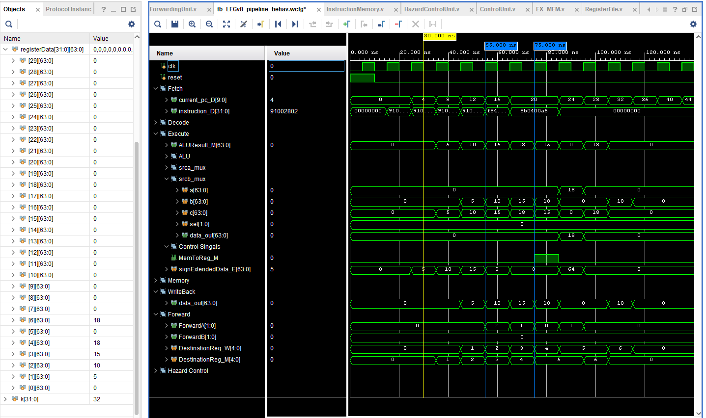

# ARM_LEGv8_pipeline
This is an implementation of LEGv8 architecture pipeline, support data forwarding, hazard control using verilog

## Table of contents
+ [**Introduction**](#introduction)
+ [**Architecture**](#Architecture)
+ [**Pipelining with Forwarding and Hazard Detection Unit**](#pipelining-with-forwarding-and-hazard-detection-unit)
+ [**Testing with Instructions**](#testing-with-instructions)
+ [**Results**](#results)
+ [**Instruction Pipeline**](#instruction-pipeline)
+ [**Compilation and Elaboration**](#compilation-and-elaboration)
+ [**Results**](#results)

## Introduction
The ARMv8 architecture is a 64-bit architecture with native support for 32 bit instructions. It has 31 general purpose registers, each 64-bits wide. Compared to this, the 32-bit ARMv7 architecture had 15 general purpose registers, each 32-bits wide. The ARMv8 follows some key design principles:
	
	- Simplicity favours regularity
	- Regularity makes implementation simpler
	- Simplicity enables higher performance at lower cost
	- Smaller is faster
	- Different formats complicate decoding, therefore keep formats as similar as possible
Registers are faster to access than memory. Operating on Data memory requires loads
and stores. This means more instructions need to be executed when data is fetched from Data memory. Therefore more frequent use of registers for variables speeds up execution time.  

The project implementation includes a subset of the core LEGv8 instruction set:

* The memory-reference instructions load register unscaled ( LDUR ) and store register unscaled ( STUR )
* The arithmetic-logical instructions ADD, SUB, AND and ORR
* The instructions compare and branch on zero ( CBZ ) and branch ( B )

## Architecture

Let's start with an abstract view of the CPU. The CPU comprises of a ***Program Counter*** [*PC*], ***Instruction Memory***, ***Register module*** [*Registers*], ***Arithmetic Logic Unit*** [*ALU*] and ***Data Memory***.

The Program Counter or PC reads the instructions from the instruction memory, then modifies the Register module to hold the current instruction. The Registers pass the values in instruction memory to the ALU to perform operations. Depending on the type of operation performed, the result may need to be loaded from or stored to the data memory. If the result needs to be loaded from the data memory, it can be written back to the Register module to perform any further operations.


## Pipelining with Forwarding and Hazard Detection Unit
Pipelining is an implementation technique in which multiple instructions are
overlapped in execution.
LEGv8 instructions classically take five steps:

1. **Instruction Fetch** or *IF* -> Fetch instruction from memory.  
2. **Instruction Decode** or *ID* -> Read registers and decode the instruction.
3. **Execute** or *EX* -> Execute the operation or calculate an address. 
4. **Memory** or *MEM* -> Access an operand in data memory (if necessary). 
5. **Write Back** or *WB* -> Write the result into a register (if necessary).


## Testing with Instructions
The Instruction Memory is initialized with the following instructions,

1. Testing pipeline.
```assembly
ADDI X1, X0, #5   → 0x91001401
ADDI X2, X0, #10  → 0x91002802
ADDI X3, X0, #15  → 0x91003C03
```

2. Testing data forwarding
```assembly
ADDI X4, X3, #3   → 0x91000C64
```

3. Testing Hazard Detection Unit.
```assembly
LDUR X5, [X6, #0] → 0xF8400065
ADD X6, X5, X4    → 0x8B0400A6
```

## Results
All the data are succesfully stored in register

